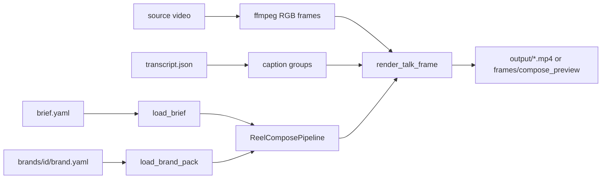

# Pipelines

All entry-point scripts live in this folder (no per-pipeline subfolders). Shared logic is in `modules/`; canvas constants are in `config/config_store.py`.

Typical order for a new reel: **import_brief** → **prepare_overlays** (if PNGs are on black) → **transcribe** (if no transcript yet) → **reel_compose** (`--preview` then `--full`).

```bash
conda activate angelica-website
```

Times in briefs are **source clock** (the original recording). Final reel time = source − `trim_start`.

---

## import_brief

Convert Angélica's spreadsheet (CSV folder or xlsx) into canonical `brief.yaml`.

Google Sheets is the human editor; YAML is the machine contract. See [templates/angelica_brief](../templates/angelica_brief/README.md). Spanish headers (`tiempo_inicio`, `lado`, `tipo`) map to `start` / `placement` / `kind`. Unknown `lado` or `tipo` values fail closed.

```bash
python pipelines/import_brief.py --csv-dir examples/ya_tienes/brief_sheet --out examples/ya_tienes/brief.yaml
python pipelines/import_brief.py --xlsx templates/angelica_brief/plantilla_reel_angelica.xlsx --out /tmp/brief.yaml
```

---

## prepare_overlays

Cut near-black backgrounds from PNG stickers (phone screenshots, emoji packs) and crop to the alpha bbox. Already-keyed assets (e.g. `examples/ya_tienes/overlays/`) skip this step.

```bash
python pipelines/prepare_overlays.py \
  --input-dir projects/mi_reel/overlays_raw \
  --output-dir projects/mi_reel/overlays \
  --thresh 28 --feather 1
```

---

## transcribe

Word-timed Whisper pass for a talking-head clip. Writes `source/transcript.json` for karaoke captions. Requires `openai-whisper`. Language comes from `brief.yaml` (`project.language`, default `es`). Speech-recognition corrections are **not** applied here — they live in the brief and run at compose time so the raw transcript stays auditable.

```bash
python pipelines/transcribe.py --project examples/ya_tienes --model medium
```

---

## reel_compose

Talking-head 9:16 reel: trim opening silence, composite brief-driven overlays and karaoke captions, fade to white, hold the brand endcard.

**Inputs:** a project folder with `brief.yaml`, source video, overlay PNGs, and (if captions are on) `source/transcript.json`.



1. **Load** — `load_brief` parses source-clock times. `build_overlay_layers` rasterises stickers and generated brush/enfoque lockups.
2. **Preview** (`--preview`) — seek-grab stills at `preview:` times (or overlay midpoints).
3. **Full** (`--full`) — stream trimmed frames, composite per frame, mux H.264 CRF 17 + AAC with audio fade/pad.

```bash
python pipelines/reel_compose.py --project examples/ya_tienes --preview
python pipelines/reel_compose.py --project examples/ya_tienes --full
```

### Placement rules (do not regress)

- Stickers sit **beside** the head (`derecha` / `izquierda`) at top-safe + brand `sticker.y_from_top_safe`, never on the hat.
- Hook titles (`gancho`) sit in the sky, below the IG crop.
- Captions share a baseline (accents must not bounce) and stay inside `caption_inset_pixels`.
- Endcard is the brand PNG letterboxed on white — do not squash into the 15–68% safe band.
