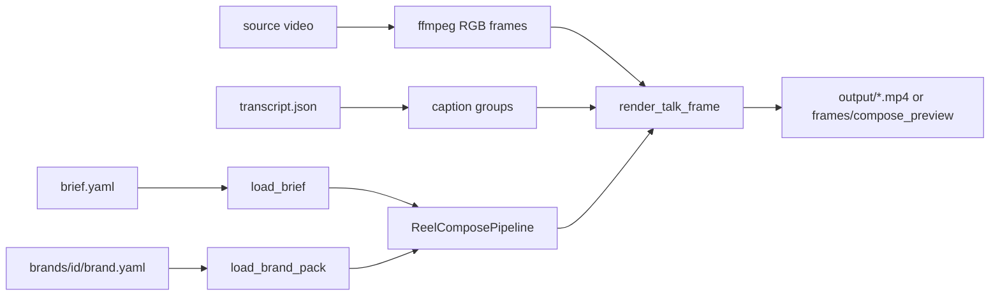

# Pipelines

All entry-point scripts live in this folder (no per-pipeline subfolders). Shared logic is in `modules/`; canvas constants are in `config/config_store.py`.

Typical order for a new reel: **import_brief** (then Cursor amends YAML) → **prepare_overlays** (if PNGs are on black) → **transcribe** (if no transcript yet) → **reel_compose** (`--preview` then `--full`).

```bash
conda activate angelica-website
```

Times in briefs are **source clock** (the original recording). Final reel time = source − `trim_start`.

---

## import_brief

Convert Angélica's spreadsheet (one-tab Excel `.xlsx`, or legacy CSV folder) into a first-pass `brief.yaml`. Pictures in the `Foto` column are extracted to `overlays/` (JPEG/WebP become PNG; the cell's display size is ignored). «Qué quieres» lands in overlay `notes`. Size words (**grande / mediano / chico**) become `max_w` / `max_h`; compose then fits the file in that box.

Her sheet stays informal. Cursor amends the YAML to the engine contract (kinds, placements). See [templates/angelica_brief](../templates/angelica_brief/README.md) and `.cursor/skills/angelica-reel-brief`. Legacy tabs with `tipo` / `lado` still import.

```bash
python pipelines/import_brief.py --xlsx projects/<slug>/BRIEF_Angelica.xlsx --out projects/<slug>/brief.yaml
python pipelines/import_brief.py --csv-dir examples/ya_tienes/brief_sheet --out examples/ya_tienes/brief.yaml
```

---

## prepare_overlays

Cut near-black backgrounds from PNG stickers (phone screenshots, emoji packs) and crop to the alpha bbox. Already-keyed assets (e.g. `examples/ya_tienes/overlays/`) skip this step.

```bash
python pipelines/prepare_overlays.py \
  --input-dir projects/mi_reel/overlays_raw \
  --output-dir projects/mi_reel/overlays \
  --thresh 28 --feather 1
```

---

## transcribe

Word-timed [Gemini 3.5 Transcribe](https://blog.google/innovation-and-ai/models-and-research/gemini-models/gemini-3-5-transcribe/) pass for a talking-head clip. Writes `source/transcript.json` for karaoke captions. Requires `google-genai` and `auth/auth-config.json` (copy `auth/auth-config.example.json` and set `gemini.api_key`). Language comes from `brief.yaml` (`project.language`, default `es` → `es-419`). Speech-recognition corrections are **not** applied here — they live in the brief and run at compose time so the raw transcript stays auditable.

Custom vocabulary cannot be combined with word timestamps on this model, so the pipeline requests timings only.

```bash
python pipelines/transcribe.py --project examples/ya_tienes
```

---

## reel_compose

Talking-head 9:16 reel: trim opening silence, composite brief-driven overlays and karaoke captions, fade to white, hold the brand endcard.

**Inputs:** a project folder with `brief.yaml`, source video, overlay PNGs, and (if captions are on) `source/transcript.json`.



1. **Load** — `load_brief` parses source-clock times. `build_overlay_layers` rasterises stickers and generated brush/enfoque lockups.
2. **Preview** (`--preview`) — seek-grab stills at `preview:` times (or overlay midpoints).
3. **Full** (`--full`) — stream trimmed frames, composite per frame, mux H.264 CRF 17 + AAC with audio fade/pad.

```bash
python pipelines/reel_compose.py --project examples/ya_tienes --preview
python pipelines/reel_compose.py --project examples/ya_tienes --full
```

### Placement rules (do not regress)

- Stickers sit **beside** the head (`derecha` / `izquierda`) at top-safe + brand `sticker.y_from_top_safe`, never on the hat.
- Hook titles (`gancho`) sit in the sky, below the IG crop.
- Captions share a baseline (accents must not bounce) and stay inside `caption_inset_pixels`.
- Endcard is the brand PNG letterboxed on white — do not squash into the 15–68% safe band.
