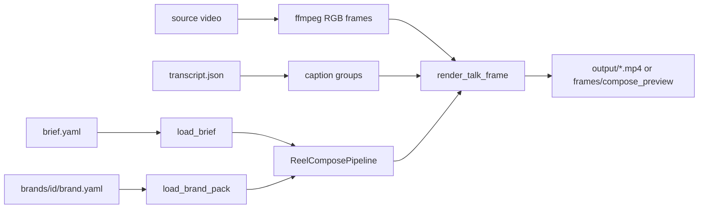

# Reel compose

Talking-head 9:16 reel: trim opening silence, composite brief-driven overlays and karaoke captions, fade to white, hold the brand endcard.

**Entry:** [`reel_compose.py`](../reel_compose.py)

**Inputs:** a project folder with `brief.yaml`, source video, overlay PNGs, and (if captions are on) `source/transcript.json`.

## Data flow



1. **Load** — `load_brief` parses source-clock times. `build_overlay_layers` rasterises stickers and generated brush/enfoque lockups.
2. **Preview** (`--preview`) — seek-grab stills at `preview:` times (or overlay midpoints).
3. **Full** (`--full`) — stream trimmed frames, composite per frame, mux H.264 CRF 17 + AAC with audio fade/pad.

Times in the brief are **source clock**. Final reel time = source − `trim_start`.

## How to run

```bash
conda activate angelica-website
python pipelines/reel_compose/reel_compose.py --project examples/ya_tienes --preview
python pipelines/reel_compose/reel_compose.py --project examples/ya_tienes --full
```

## Placement rules (do not regress)

- Stickers sit **beside** the head (`derecha` / `izquierda`) at top-safe + brand `sticker.y_from_top_safe`, never on the hat.
- Hook titles (`gancho`) sit in the sky, below the IG crop.
- Captions share a baseline (accents must not bounce) and stay inside `caption_inset_pixels`.
- Endcard is the brand PNG letterboxed on white — do not squash into the 15–68% safe band.
